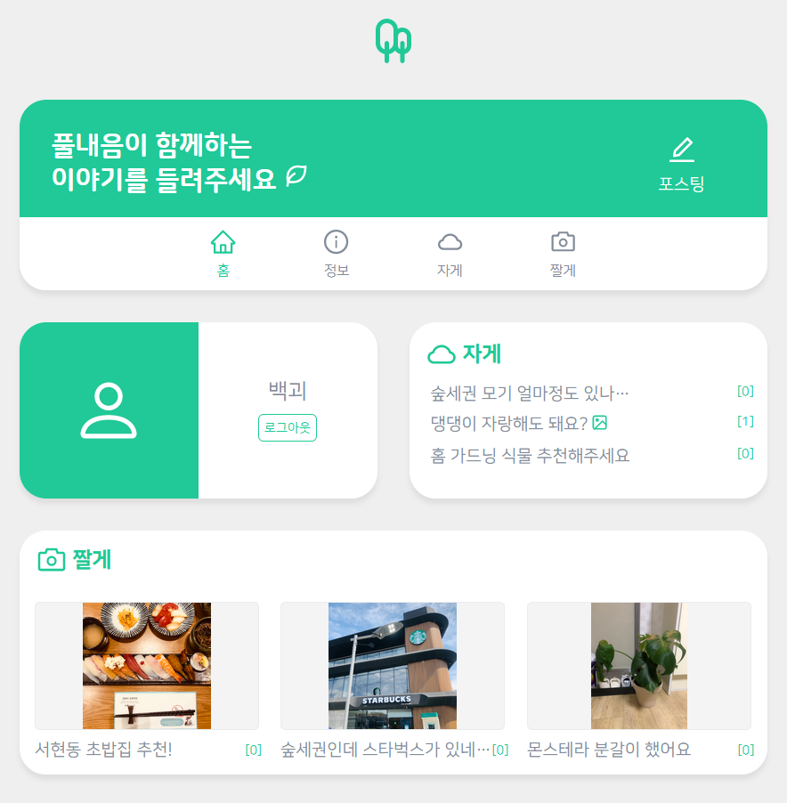
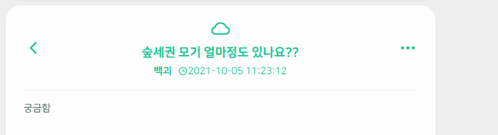

# 🌳 Forestia.

**Next.js** 학습을 목적으로 제작하게 된 게시판 사이트입니다.

> ⚒ 작업 중 ⚒

</img>

## 📃 개요

- SSR을 쉽게 구현할 수 있도록 하는 리액트 기반 프레임워크인 **Next.js**에 적응하기 위해 제작하게 된 커뮤니티 사이트입니다.
- **숲세권 자취 이야기**라는 마이너한 컨셉으로 제작하였으며, 해당 컨셉에 알맞는 초록색을 퍼스널 컬러로 지정하였습니다.
- 'Forestia'라는 커뮤니티명은 성남시 수정구 신흥동에 위치한 <a href="https://www.lottecastle.co.kr/APT/AT00212/main/index.do">산성역 포레스티아</a> 아파트에서 따왔습니다.

## 💻 사용 기술

- Front-End
     
- Back-End
    

## 📜 간략한 프로젝트 설명

- 간단한 게시판 사이트입니다. 게시글 및 댓글의 작성/수정/삭제가 가능합니다.
- 본 레포에는 Client단과 Server단이 통합되어 있습니다.
- 로그인의 경우 Google 계정으로 가능합니다.
- 게시판은 **자게/짤게** 두 분류로 나뉘어져 있으며, 짤게의 경우 **이미지 업로드가 필수**입니다.
- DB의 경우 **MongoDB Atlas**를 이용하였으며, **Axios**를 통한 API 통신이 이루어집니다.
- Express 연동을 통해 서버단에 저장되는 이미지의 로딩 및 삭제가 이루어집니다.
- 최대한 **아토믹 디자인 패턴** 지향적으로 설계하였습니다.

## 📸 간단한 시연

- 홈 페이지  
  </img>

- 게시글 작성  
  </img>

- 좋아요 및 댓글 작성  
  </img>

- 게시글 삭제  
  </img>
